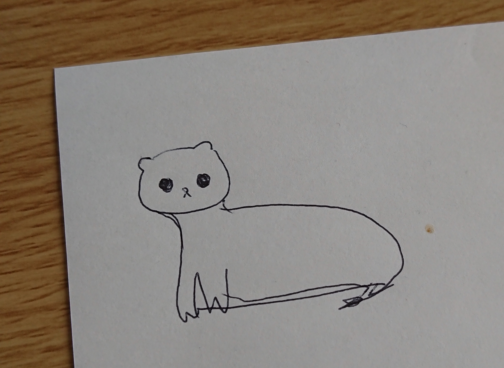

# About
こんにちは○○です。Githubページテストです
Web
Web開発　マーケティングを中心に活動しています。

# Profile
オコジョ
所在地　水のきれいな森
ライティング、ホームページ制作
# 見出し
## 見出し
### 見出し
本文です。

マークダウンの入力方法
改行されない文章
改行されない文章

改行された文章（文章のあとにスペース2つ）  
改行された文章  

段落（空の行は段落になる）

[これが実際のリンクです](https://okojyowebdevelopment.github.io/)

順序なしリスト  
- 要素1  
- 要素2  
- 要素3  
 
順序付きリスト  
 1. 要素1  
 1. 要素2  
 1. 要素3  
 
# Skills  
- WordPress
- GitHub  
- HTHL CSS  
※JavaScriptなどは詳しくなんの言語が使えるか書いたほうが良い。

# Works  
- [GitHub Page Okojyo](https://okojyowebdevelopment.github.io)  
-作った作品   
　- [GitHub Page Okojyo](https://okojyowebdevelopment.github.io)  
　- [GitHub Page Okojyo](https://okojyowebdevelopment.github.io)  
- GitHub Page  

# Contact  
　- [twitter](https://okojyowebdevelopment.github.io)  
　- [インスタグラム](https://okojyowebdevelopment.github.io)  
　- ここにメールアドレス（直に載せていいかも）
 
 文章中にコードを書くときは`<br>`と書きます  
 
 ```js
 function add(a, b) {
  return a + b;
 }
 ```
 
 **これで太字がかけます**
 
 > 文書の引用はこのように書きます。
 
 水平線はこのように書きます
 
***
*****
- - -
---------------------------------------

<iframe width="560" height="315" src="https://www.youtube.com/embed/NEDoDWMYEpc" frameborder="0" allow="accelerometer; autoplay; encrypted-media; gyroscope; picture-in-picture" allowfullscreen></iframe>


